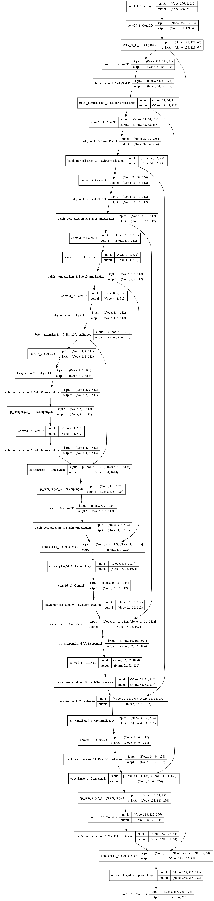
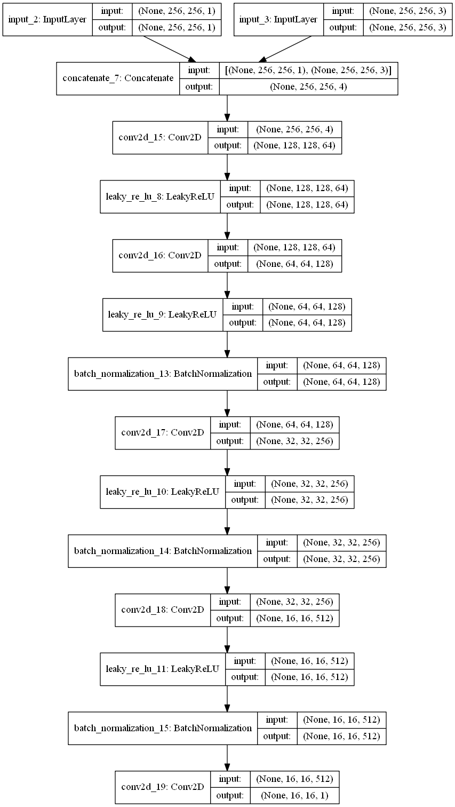
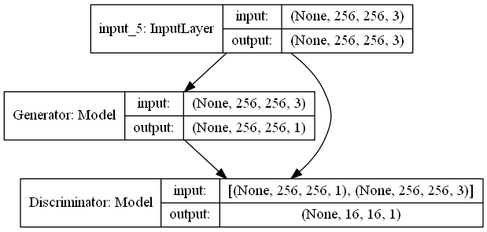

# rmbgGAN

### Version and Recommend Requirement
- python -> [3.6.x](https://www.python.org/downloads/)
- opencv -> [3.4.3.18](https://pypi.org/project/opencv-python/3.4.3.18/)
- keras -> [2.1.5](https://pypi.org/project/Keras/2.1.5/)
- tensorflow -> [1.14.0](https://pypi.org/project/tensorflow/1.14.0/)
- h5py -> [latest](https://pypi.org/project/h5py/)
- numpy -> [latest](https://pypi.org/project/numpy/)
- scipy -> [1.0.0](https://pypi.org/project/scipy/1.0.0)
- CUDA10 and cuDNN7.4 with RTX2070

### Introduce
This project is used for auto remove portrait background. In the future,
the model perhaps will apply for more object background removed.

- Generator
<p align="center">
	
</p>

- Discriminator
<p align="center">
	
</p>

- GAN
<p align="center">
	
</p>

### The flow
Training -> Generate mask -> mask deNoise -> 'AND' calculate portrait and mask -> portrait without background

### Dataset
I prepare a dataset for demo.</br>
[nobg_mask.npz](https://mega.nz/#!q4FnyILY!4f6a7rygALMMuUycWWIpn5LhCdwN-LM3ZI2dFHcH1Dw)

After downloaded, create a folder named `Dataset` and put the dataset in this folder.

### Training
There are some parameter that you can modify in `train.py`
```python
p2p.train(name="NBGM", models=[generator, discriminator, p2pgan], epochs=250, batch_size=16, sample_interval=5)
```
- name -> output graphic's title
- models -> Do not change anything
- epochs -> Recommend between 250 and 300
- batch_size -> If you have large video card RAN than me, more it!!
- sample_interval -> Description as below</br>
Interval for save graphic during model training,
if dataset size = 300, batch_size = 16, then your have total 18 iters for 250 epochs,
so this program will save graphic at 1, 5, 10 and 15 iter.


After setting, run command as blow:
```bash
python train.py
```

### Testing
1. Find `main.py` and open it
2. You can modify something as blow
- Set GPU memory limit, like Utils.SET_GPU_MEM(0.7), so gpu will run with 70% GPU RAM
```python
Utils.SET_GPU_MEM(Default 0.5)
```

- Set your images which should be input
```python
rowImgname = "yourIamgeName.jpg".split(".")[0]
rowImg = misc.imread(rowImgname+".jpg")
```

- Set your own model name
```python
model_nobg = load_model("models/yourModelName.h5")
```

3. After some settings as above, run with the command below
```bash
python main.py
```
